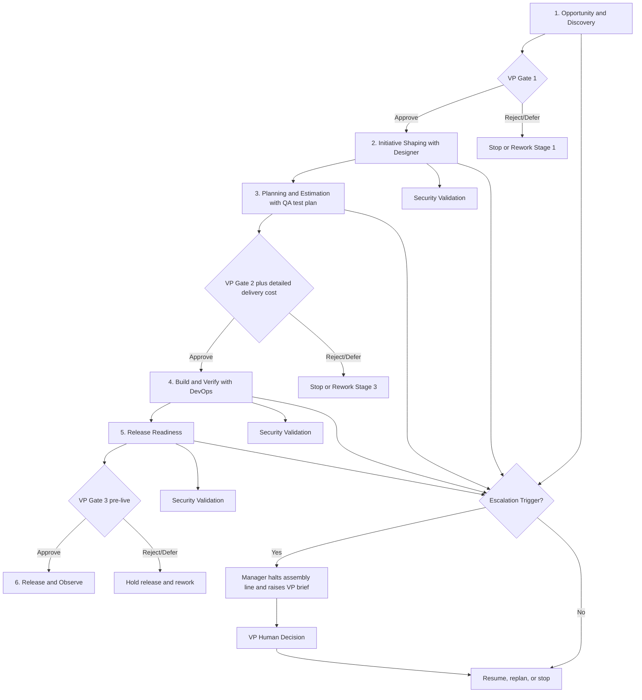

# Software Development Lifecycle (SDLC)

This document defines the mandatory SDLC for all work in this repository.

## Objectives

- Ensure every initiative follows the same lifecycle.
- Create consistent handoffs between subagents.
- Enforce human VP sign-off only at defined gates.
- Make security validation continuous, not one-time.

## SDLC Phases and Required Artifacts

1. Opportunity and Discovery (`product-manager`)
   - Primary artifact: PRD (product requirements document)
   - PRD minimum sections: problem statement, value hypothesis, success metrics, functional requirements, non-functional requirements, initial budget envelope
2. Initiative Shaping (`product-manager`, `designer`, `architect-security`)
   - Artifacts: design discovery outputs, UX/UI design spec, architecture document, threat model, scope boundaries, initial epic map
3. Planning and Estimation (`program-manager`, `engineering-manager`, `developer`, `qa`)
   - Artifacts: work breakdown, estimate baseline, dependency map, milestone plan, QA test plan
   - User story schema (required per story): description, acceptance criteria, story points (ideal days), criticality (must/should/could/wont)
4. Build and Verify (`developer`, `qa`, `devops`)
   - Artifacts: implementation PRs, automated test evidence mapped to QA test plan, defect log, quality summary
5. Release Readiness (`devops`, `qa`, `architect-security`)
   - Artifacts: release checklist, security validation report, rollout and rollback plan
6. Release and Observe (`devops`, `program-manager`, `product-manager`)
   - Artifacts: deployment record, KPI snapshot, budget variance report, follow-up actions

## VP Human Sign-Off Gates (Fixed Stage Gates)

VP sign-off is required only at these three stage transitions:

1. Between Stage 1 and Stage 2 (go/no-go on designing the opportunity)
2. Between Stage 3 and Stage 4 (execution authorization with detailed delivery cost estimate)
3. Before live release (between Stage 5 and Stage 6)

Outside these fixed stage gates, VP sign-off is not required unless an escalation trigger occurs.

## Escalation Triggers (Any Phase)

If any trigger occurs, agents must halt and request VP decision regardless of stage:

- Budget variance > 15% versus approved baseline
- Scope increase > 20% effort versus approved scope
- High/critical unresolved architecture or security risk
- High release risk (rollback uncertainty, major customer impact, critical unresolved defects)

## Security Validation Cadence

- Shaping: identify trust boundaries, threat scenarios, and required controls.
- Build: run recurring code/dependency/security validation.
- Release readiness: confirm security controls and residual risk statement.

## Test Strategy Policy

- QA owns and maintains the test plan in Stage 3.
- Stage 4 test evidence must map back to test-plan items.
- Automated testing is the default model.
- Follow the test pyramid:
  - broad base: static analysis and fast checks
  - then unit tests
  - then integration tests
  - minimal end-to-end tests
- Manual testing is primarily exploratory and not the primary validation path.

## Operating Flowchart

## Completion Criteria

Work is considered SDLC-compliant only when:

- phase artifacts are complete,
- required handoffs occurred,
- security validation was executed at required checkpoints,
- fixed stage-gate VP approvals are recorded at 1->2, 3->4, and pre-live,
- and any escalation-triggered halt has a recorded VP human decision.
